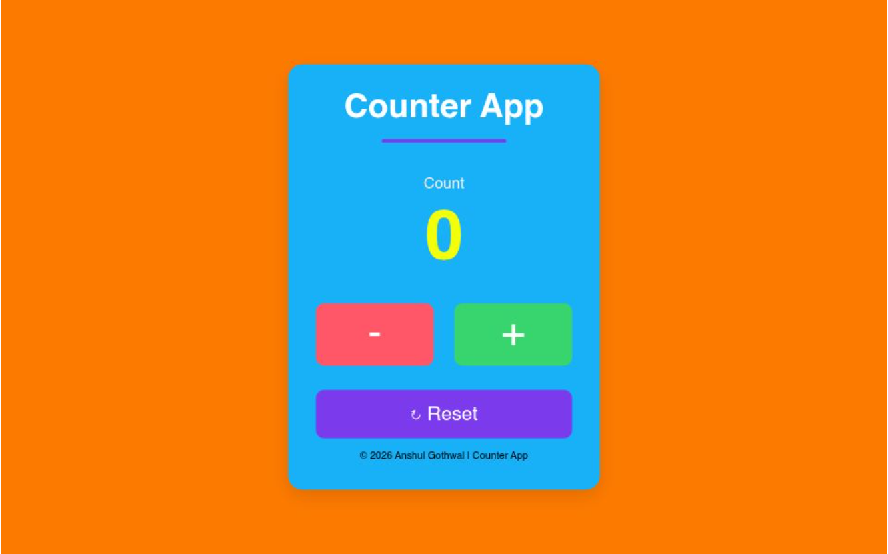

# Counter App

A simple and responsive Counter App built using HTML, CSS, and JavaScript.

## Preview



## Live Demo

🌐 Live Website: https://counter-app-six-rho-33.vercel.app/

## Features

* Increase counter value
* Decrease counter value
* Reset counter to zero
* Responsive design
* Clean and modern UI
* Built with Vanilla JavaScript

## Technologies Used

* HTML5
* CSS3
* JavaScript (ES6)

## Project Structure

```bash
Counter-App/
│
├── index.html
├── style.css
├── script.js
└── README.md
```

## How It Works

* Clicking the **+** button increases the counter value.
* Clicking the **-** button decreases the counter value.
* Clicking the **Reset** button sets the counter back to zero.
* The displayed value updates dynamically using DOM manipulation.

## What I Learned

Through this project, I practiced:

* DOM Manipulation
* Event Listeners
* JavaScript Variables
* Responsive Design
* Flexbox Layout
* Project Deployment using Vercel

## Author

**Anshul Gothwal**

* GitHub: https://github.com/AnshulGothwal

---

⭐ If you like this project, feel free to give it a star.
